# CDE CI/CD pipelines with CML


## Project Summary

This tutorial demonstrates how you can build CI/CD pipelines to prototype your Spark jobs in the Cloudera Machine Learning Service and deploy them in the Cloudera Data Engineering Service for more sophisticated Spark Job management, visibility and troubleshooting. 

This tutorial is divided into the following sections:

1. Installing the CDE CLI
2. A CDE CLI and API tutorial
3. A simple CDE CI/CD pipeline with CML Jobs and CML API v2


## Prerequisites

This project requires access to a CML Workspace and a CDE Virtual Cluster. This could be either in CDP Public or Private Cloud. 

Some familiarity with Python, CLI’s and API’s in general, and Jupyter Notebooks is recommended. 
However, no coding is required beyond executing the provided notebooks.

If you are completely new to CML and would like a quick intro to creating Projects, Sessions, using Spark and more, 
please start with [this repository](https://github.com/pdefusco/CML_CrashCourse)


## CML Project Setup

Navigate to the CDP Management Console and open your environment.

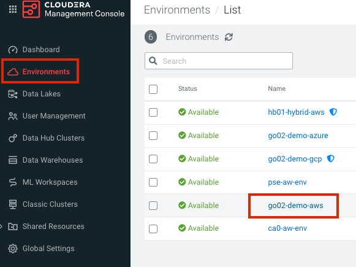

In the next page, take note of the region. For example, in the screenshot below this is ```“us-east-2”```. 
Save this to your editor, you will need this later.

Navigate to your CML Workspace and create a new project as shown below. 

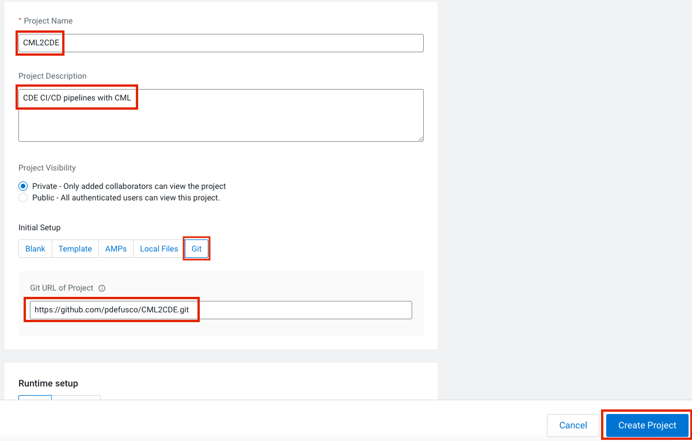

Select the Git Option and paste the following URL:

```https://github.com/pdefusco/CML2CDE.git```

There is no need to customize the Runtime Setup settings at the bottom of the page. Default option values are fine. 

Within the project, launch a CML Session with the following settings:

~~~
Session Name: Setup Session (anything is fine here)
Editor: Workbench
Kernel: Python 3.7 or above
Enable Spark: disabled
Resource Profile: 2 vCPU / 4 GiB Memory - 0 GPUs
Other settings: default values are fine.
~~~

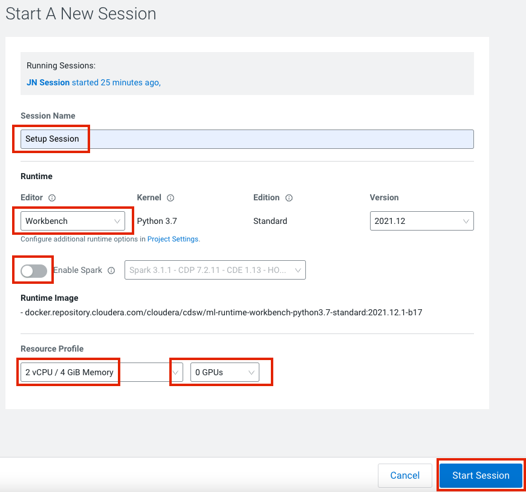

Next, open script ```“0_Setup.py”``` and hit the play button at the top of the screen to run all code at once. 

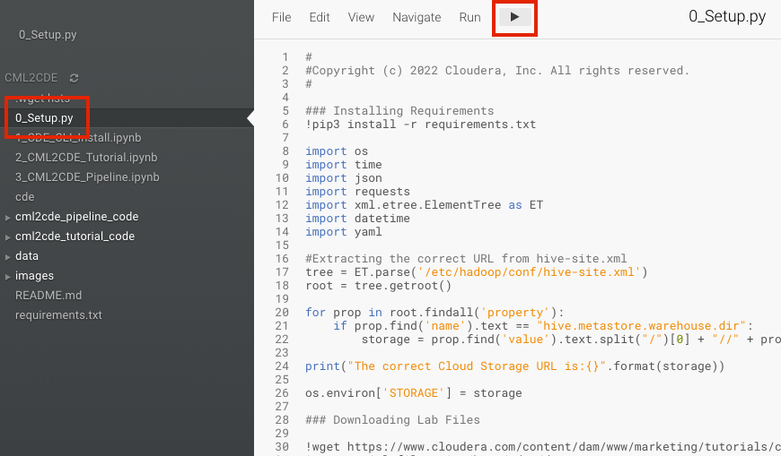


This script will print the Cloud Storage environment variable to the screen, 
download all data for the tutorial, and move it from the local /home/cdsw folder to a new Cloud Storage folder. 

This works for both AWS and Azure without edits.

Follow along while the code executes on the right side of the screen. 
When the prompt turns back to green, enter the following code snippet and copy the output to your editor. 
Make a note, this will be the “STORAGE” variable.

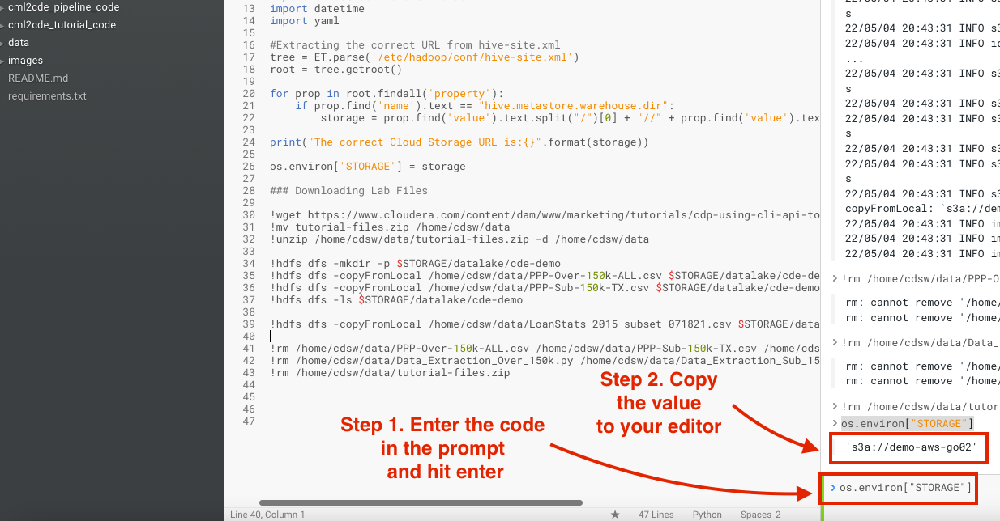

Next, navigate to your CDE Virtual Cluster. Open the Cluster Details page as shown below.

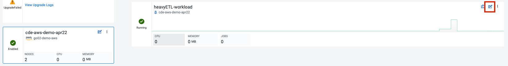

Copy the value for the JOBS_API_URL to your editor. 

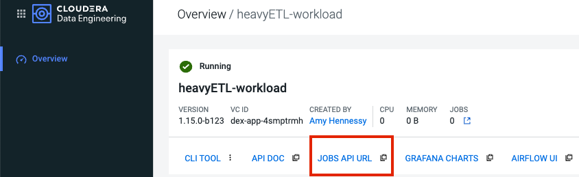

Finally, save the values you pasted in your editor as CML Project Environment Variables.

Navigate to the “Project Settings” menu and open the “Advanced” tab. 
Set the variables with the following keys and values as shown below.

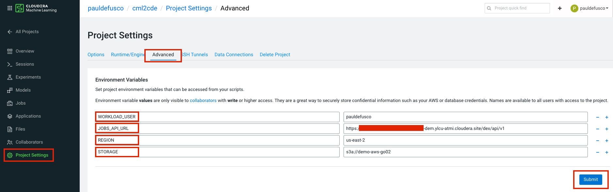

Finally, go back to CML and kill your current Workbench Editor session. You won’t need it anymore.


## Part 1: Installing the CDE CLI

Navigate back to the CML Project home. Launch a new session with the following settings:

~~~
Session Name: “JupyterLab Session”
Editor: JupyterLab
Kernel: Python 3.7 or higher
Enable Spark: off
Resource Profile: 2 vCPU / 4 GiB Mem - No GPUs required.
Other options: you can leave the remaining options such as Edition and Version to their default values. 
~~~

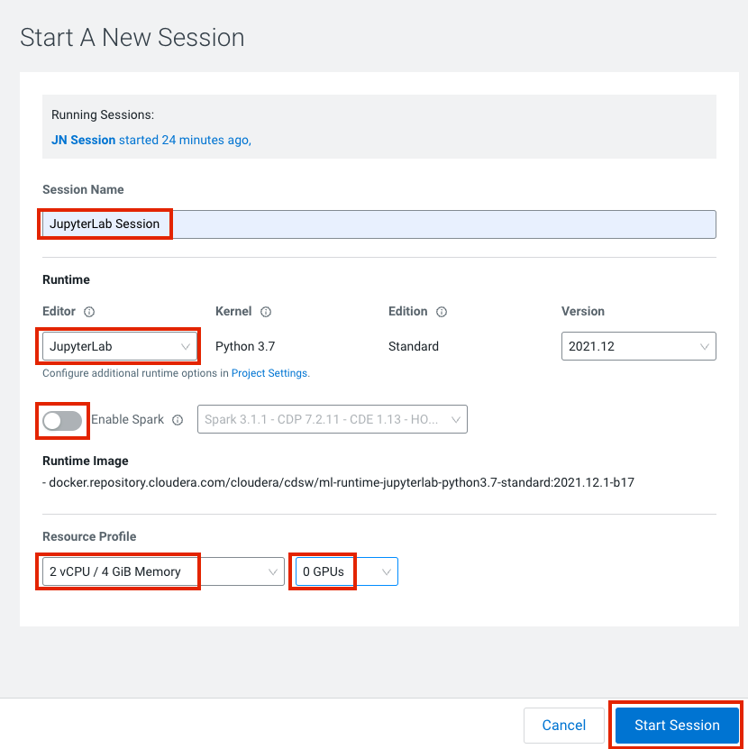


Open Notebook ```"1_CDE_CLI_Install.ipynb”```. The notebooks shows you how to install the CDE CLI. 
Notice that although we will complete this process in CML, this can just as easily be done in your local machine. 

Run all cells by clicking on “Run” -> “Run All Cells” as shown below. No changes to the code are required. 

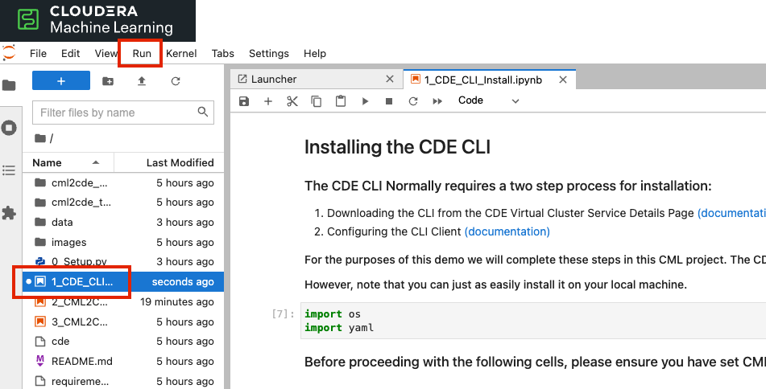


## Part 2: A CDE CLI and API tutorial

Next, open Notebook “2_CML2CDE_Tutorial.ipynb”. This notebook provides some examples on the following topics:

~~~
Running a simple PySpark job in CML from the CML Session Notebook
Sending Spark-Submit commands via the CDE CLI from the CML Session Terminal
Working with the CDE API from the CML Session Notebook
Composing the same API requests with the Python Requests library
Submitting a final PySpark job in CML from the same CML Session Notebook to effortlessly read the same data that was processed in CDE
~~~

Walk through the notebook and follow along in each cell. Detailed instructions are provided in the Notebook Markdown cells. 

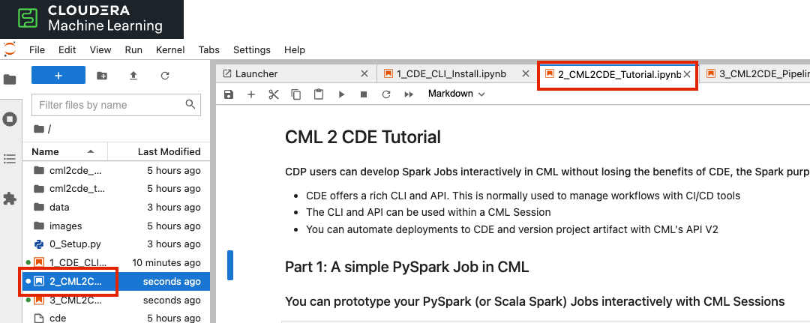


## Part 3: A simple CDE CI/CD pipeline with CML Jobs and CML API v2

Finally, open Notebook ```“3_CML2CDE_Pipeline.ipynb”```. APIv2 is the native CML Python Library to build CI/CD and ML Ops pipelines. 
This notebook uses APIv2 to build a CI/CD Pipeline made of CDE Jobs. Specifically in this notebook you will:

* Instantiate two CML Jobs and trigger their execution with APIv2 
* Each CML Job will include one or more API calls to CDE. As a whole they will constitute a workflow to move PySpark Jobs from CML to CDE Resources.

For more on CML APIv2 it, please visit the “Related Demos and Tutorials” section below. 


## Conclusions

In this tutorial you have built a workflow using CML Sessions and CDE Jobs. The main takeaways are:

* CML and CDE can both be used to build Spark ML and ETL Pipelines. Each has its advantages but you don’t have to choose. 
* CDP is foundationally built on SDX. CDE and CML datasets and workloads are all tracked from SDX. 
* This implies that any results from Spark Jobs running in CDE are available to CML users, and vice versa. 
* You can close the loop and switch back and forth between CML and CDE at will. 
* Of course, if you prefer not to share your datasets with other users, Ranger and SDX will allow you to impose such limitations.


## Related Demos and Tutorials

If you are evaluating CML you may also benefit from testing the following demos:

* [Telco Churn Demo](https://github.com/pdefusco/CML_AMP_Churn_Prediction): Build an End to End ML Project in CML and Increase ML Explainability with the LIME Library
* [Learn how to use Cloudera Applied ML Prototypes](https://docs.cloudera.com/machine-learning/cloud/applied-ml-prototypes/topics/ml-amps-overview.html) to discover more projects using MLFlow, Streamlit, Tensorflow, PyTorch and many more popular libraries
* [CSA2CML](https://github.com/pdefusco/CSA2CML): Build a real time anomaly detection dashboard with Flink, CML, and Streamlit
* [SDX2CDE](https://github.com/pdefusco/SDX2CDE): Explore ML Governance and Security features in SDX to increase legal compliance and enhance ML Ops best practices 
* [API v2](https://github.com/pdefusco/CML_AMP_APIv2): Familiarize yourself with API v2, CML's goto Python Library for ML Ops and DevOps
* [MLOps](https://github.com/pdefusco/MLOps): Explore a detailed ML Ops pipeline powered by Apache Iceberg


### Next Steps

The pattern of using CML and CDE in tandem opens up possibilities for more advanced use cases. 

* CML Jobs can be used as a CI/CD management system in conjunction with any 3rd party API. 
* CML APIv2 has a rich set of methods allowing you to embed advanced ML-driven decision making as part of your DevOps process. 
* The CDE API is much richer than we've seen above. You can download logs, override Spark Job Configurations such as Physical Resources, and a lot more. 
* Thus, you can build automated Spark tuning and troubleshooting pipelines to move Spark Jobs that pose significant challenges to CDE for improved Job visibility.
* Apache Airflow is native in CDE. You can also deploy Airflow in CML Applications. 
* You can build and prototype Airflow DAGs in CML and push them to CDE in ways similar to the pipeline shown in this demo.


